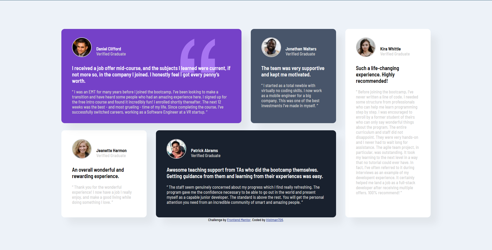

# Frontend Mentor - Testimonials grid section solution

This is a solution to the [Testimonials grid section challenge on Frontend Mentor](https://www.frontendmentor.io/challenges/testimonials-grid-section-Nnw6J7Un7). Frontend Mentor challenges help you improve your coding skills by building realistic projects. 

## Table of contents

- [Overview](#overview)
  - [The challenge](#the-challenge)
  - [Screenshot](#screenshot)
  - [Links](#links)
- [My process](#my-process)
  - [Built with](#built-with)
  - [What I learned](#what-i-learned)
- [Author](#author)

## Overview

### The challenge

Users should be able to:

- View the optimal layout for the site depending on their device's screen size

### Screenshot



### Links

- Solution URL: [Solution URL](https://www.frontendmentor.io/solutions/testimonialgridsectionmain-72p-XPV86b)
- Live Site URL: [Live site URL](https://inspiring-madeleine-0e2bb1.netlify.app/)

## My process

### Built with

- Semantic HTML5 markup
- CSS custom properties
- Flexbox
- CSS Grid

### What I learned

I learned when it is better to use grid area or grid column, in this case I used grid column because it was more comfortable and practical.

```css
section:first-child{
  background-color: var(--moderate-violet);
  color: white;
  grid-column: 1 / 3;
  position: relative;
}

section:nth-child(2){
  background-color: var(--very-dark-grayish-blue);
  color: white;
}

section:nth-child(3){
  grid-column: 4 / -1;
  grid-row: 1 / 3;
}


section:last-child{
  background-color: var(--very-dark-blackish-blue);
  color: white;
  grid-column: 2 / 4;
}
```
## Author

- Website - [inspiring-madeline](https://inspiring-madeleine-0e2bb1.netlify.app/)
- Frontend Mentor - [@Histman726](https://www.frontendmentor.io/profile/Histman726)
